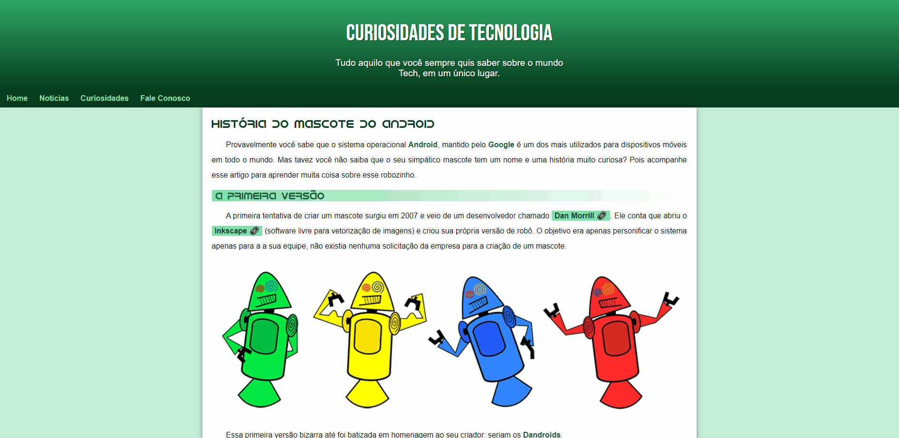
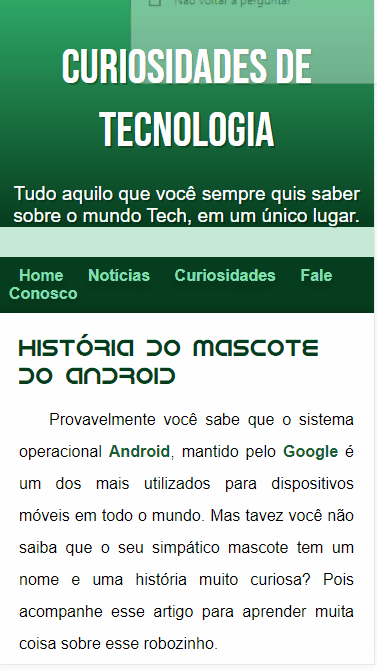

# Curso em Vídeo | Desafio mini-projeto

## Tabela do Conteudo

<ul>
<li><a href="#sobre">Sobre</a></li>
<li><a href="#status">Status</a></li>
<li><a href="#objetivo">Objetivo</a></li>
<li><a href="#tecnologias">Tecnologias</a></li>
<li><a href="#acessando-o-site">Acessando o site</a></li>
</ul>

## Sobre

### Layout Desktop | Mobile

## Status

Desafio concluído! 👌

## Objetivo

Meu objetivo era criar um site sobre o mascote do android e de maneira responsiva para versão mobile.

## Tecnologias

<ul>
<li>HTML</li>
<li>CSS</li>
<li>GIT BASH</li>
</ul>

## Acessando o site

Para acessar meu desafio, por favor use esse link : <a href="https://tiago-forward.github.io/resolvendo-desafio-mini-projeto-cursoemvideo/" target="_blank">Curso em Vídeo| Desafio mini-projeto</a>